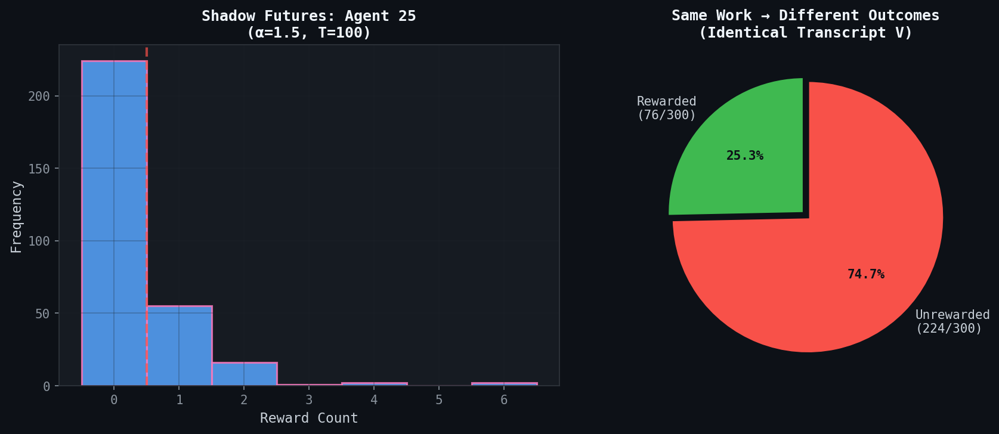
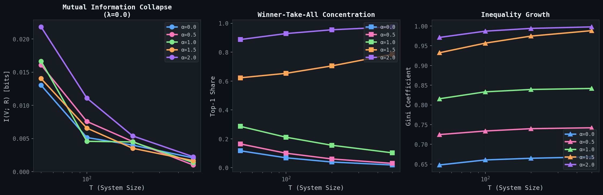

# Shadow Futures

A minimal Python implementation demonstrating that verifiable work cannot reliably signal value in path-dependent economies.

## What Are Shadow Futures?

A **shadow future** is an unrealized outcome trajectory in which an agent performs identical verified work to a successful agent but fails to receive reward due solely to unfavorable timing or network position.

In systems with preferential attachment, reward probability depends on accumulated position rather than marginal effort:

```
P(reward_i) = A_i(t)^alpha / sum_j A_j(t)^alpha
```

where `A_i(t)` is agent i's cumulative attachment at time t and `alpha >= 1` implies increasing returns.

The existence of shadow futures means that observing a successful outcome does not identify the causal role of work. Identical work histories are compatible with both success and failure.

## What This Code Demonstrates

This repository provides empirical demonstrations of three claims from the paper:

1. **Divergent outcomes from identical work.** Running simulations with identical parameters but different random seeds shows that a focal agent with the same verified work transcript sometimes succeeds and sometimes fails.

2. **Mutual information collapse.** The mutual information between work transcripts and realized rewards decreases as system size grows and path dependence strengthens.

3. **Concentration dynamics.** Rewards concentrate among early entrants as the preferential attachment exponent increases.



*Left: Distribution of reward counts for a focal agent across 500 simulations with identical work. Right: Fraction of simulations where the agent received any reward vs none.*



*Mutual information between work transcripts and rewards as a function of system size T, for different values of alpha. Higher alpha leads to faster concentration and lower MI.*

## What This Code Does Not Claim

- It does not claim that work has no local effect on outcomes.
- It does not claim that early effort is irrelevant.
- It does not make normative claims about fairness or desert.
- It does not model strategic behavior, heterogeneous skills, or external shocks.

The model isolates a single mechanism: path-dependent reinforcement. The results show that even under ideal conditions (perfect verification, identical effort), work cannot be identified as the cause of success once allocation is dominated by network position.

## Installation

```bash
git clone https://github.com/merlic/shadow-futures.git
cd shadow-futures

python -m venv venv
venv\Scripts\activate      # Windows
# source venv/bin/activate # Linux/macOS

pip install -e ".[dev]"
```

Requires Python 3.11 or later. Dependencies: numpy, matplotlib, pytest.

## Usage

All outputs are saved to the `figures/` directory.

### Run a single simulation

```bash
python -m shadow_futures simulate --T 100 --alpha 1.5 --seed 42
```

Outputs JSON with summary statistics including mutual information, Gini coefficient, and top-k concentration.

### Generate mutual information plots

```bash
python -m shadow_futures plot-mi --T-values 50,100,200,500 --alphas 0.0,1.0,2.0 --n-runs 30
```

Produces plots showing MI collapse across system sizes and alpha values.

### Demonstrate shadow futures

```bash
python -m shadow_futures shadow-futures --T 100 --alpha 1.5 --n-simulations 500
```

Runs repeated simulations and shows the distribution of outcomes for a focal agent with identical work across all runs.

## Running Tests

```bash
pytest
```

37 tests cover core invariants: determinism, reward conservation, attachment monotonicity, and metric correctness.

## Project Structure

```
shadow-futures/
├── src/shadow_futures/
│   ├── process.py     # Preferential attachment dynamics
│   ├── simulate.py    # Experiment runners
│   ├── metrics.py     # MI estimation, Gini, concentration
│   ├── plots.py       # Visualization
│   └── cli.py         # Command-line interface
├── tests/
│   ├── test_process.py
│   └── test_metrics.py
├── figures/           # Generated outputs
└── pyproject.toml
```

## Citation

```
Erlic, M. (2025). Shadow Futures: Why Verifiable Work Cannot Signal Value
in Path-Dependent Economies.
```

## License

MIT
